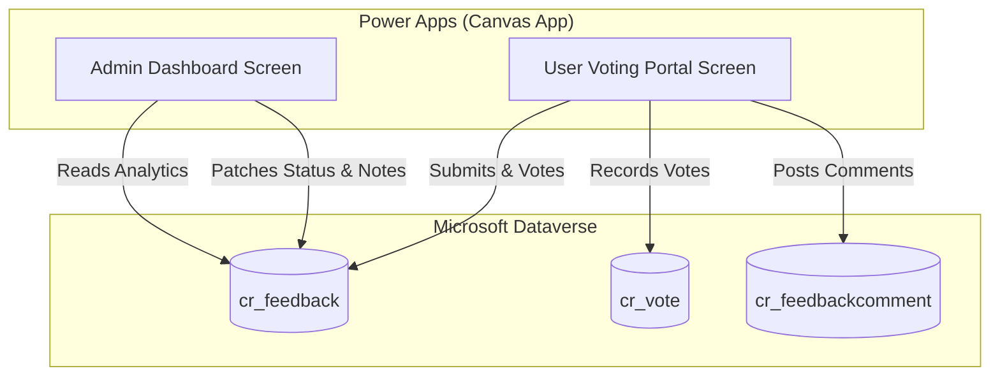

# 💡 Internal Feedback & Feature Suggestion App

An enterprise-grade **Microsoft Power Apps (Canvas)** application designed to streamline internal employee feedback, feature requests, and product roadmap transparency. The system features a public-facing **Voting & Discussion Portal** for users and an executive **Admin Management Dashboard** for tracking KPIs, updating roadmap statuses, and issuing official responses.

---

## 📖 Table of Contents
- [About the Project](#about-the-project)
- [Key Features](#key-features)
  - [User Experience](#user-experience)
  - [Admin Experience](#admin-experience)
- [Architecture & Tech Stack](#architecture--tech-stack)
- [Dataverse Data Model](#dataverse-data-model)
  - [1. Feedback Table (`cr_feedback`)](#1-feedback-table-cr_feedback)
  - [2. Votes Table (`cr_vote`)](#2-votes-table-cr_vote)
  - [3. Feedback Comments Table (`cr_feedbackcomment`)](#3-feedback-comments-table-cr_feedbackcomment)
- [UI Design & Color System](#ui-design--color-system)
- [Setup & Deployment Guide](#setup--deployment-guide)

---

## About the Project

The **Internal Feedback & Feature Voting App** bridges the gap between end-user feature requests and administration decision-making. Employees can submit new ideas, vote on existing submissions, comment on ideas, and track real-time progress through clear roadmap indicators. 

Administrators gain full control over the feedback pipeline—monitoring key performance metrics (KPIs), transitioning status stages (*Under Review*, *In Progress*, *Shipped*, *Out of Scope*), and attaching official admin responses to maintain open communication across the organization.

---

## 🎬 App Walkthrough & Demo

  <video src="https://github.com/user-attachments/assets/14169f2c-4b19-42f9-87be-5e9e890a962e" controls="controls" muted="muted" style="max-width: 100%;">
  </video>

> 💡 *Watch the demo above to see the user voting interface, real-time comment threads, and the admin management dashboard in action.*

## Key Features

### User Experience
* **Feature Submission:** Quick-entry form allowing users to submit feedback with title, description, and an option to post anonymously.
* **Upvoting System:** Toggle voting system backed by a dedicated `Votes` table to prevent duplicate votes per user and maintain accurate vote tallies.
* **Interactive Comments:** Dynamic popup overlay with backdrop dimming to read and post comments per feedback item.
* **Roadmap Visibility:** Clear status badges (*Under Review*, *In Progress*, *Shipped*, *Out of Scope*) and official admin responses displayed directly on each feedback card.

### Admin Experience
* **KPI Metrics Dashboard:** At-a-glance summary cards showing *Total Feedbacks*, *In Progress*, *Shipped*, and *Out of Scope* counts.
* **Master-Detail Panel Layout:** Master list with search and status filtering on the left, paired with a detailed status and response editor on the right.
* **Lifecycle Status Management:** Ability to update feedback lifecycle stages with dynamic UI badge updates across both admin and user views.
* **Official Admin Notes:** Input panel to write contextual responses, rollout schedules, or explanation notes attached directly to feature items.

---

## Architecture & Tech Stack

* **Frontend Platform:** Microsoft Power Apps (Canvas App )
* **Backend Database:** Microsoft Dataverse
* **Formula Language:** Power Fx

---

## Dataverse Data Model

### 1. Feedback Table (`cr_feedback`)

| Column Display Name | Schema Name | Data Type | Description / Options |
| :--- | :--- | :--- | :--- |
| **Title** | `cr_title` | Single Line of Text | Concise title of the feature or feedback. |
| **Description** | `cr_description` | Multiple Lines of Text | Full details submitted by the user. |
| **Vote Count** | `cr_votecount` | Whole Number | Aggregate/calculated count of votes for fast rendering. |
| **Feedback Status** | `cr_status` | Choice | Options: `Under Review` *(Default)*, `In Progress`, `Shipped`, `Out of Scope`. |
| **Admin Note** | `cr_adminnote` | Multiple Lines of Text | Official update text or response written by an admin. |
| **Is Anonymous** | `cr_isanonymous` | Two Options (Yes/No) | Flags whether author name should be hidden. |

### 2. Votes Table (`cr_vote`)

| Column Display Name | Schema Name | Data Type | Description / Options |
| :--- | :--- | :--- | :--- |
| **Vote Name** | `cr_name` | Single Line of Text | Primary name field / Auto-generated identifier. |
| **Feedback** | `cr_feedback` | Lookup | N:1 relationship linking back to `cr_feedback`. |
| **Voter Email / User** | `cr_voter` | Single Line of Text / User | Identifier for tracking user votes and preventing duplicates. |

### 3. Feedback Comments Table (`cr_feedbackcomment`)

| Column Display Name | Schema Name | Data Type | Description / Options |
| :--- | :--- | :--- | :--- |
| **Comment Text** | `cr_commenttext` | Multiple Lines of Text | Content of the user comment. |
| **Feedback** | `cr_feedback` | Lookup | N:1 relationship linking back to `cr_feedback`. |

---

## UI Design & Color System

The application uses an accessible status palette that maintains color coordination between top KPI cards, gallery status pills, and detail controls:

| Status | KPI Card Fill | Badge Fill | Text Color | Meaning |
| :--- | :--- | :--- | :--- | :--- |
| **Under Review** | `#E2E3E5` | `#E2E3E5` | `#383D41` | Default state; awaiting admin evaluation. |
| **In Progress** | `#FFE082` | `#FFF3CD` | `#5C4300` | Approved and actively in development. |
| **Shipped** | `#D4EDDA` | `#D4EDDA` | `#155724` | Feature deployed to production. |
| **Out of Scope** | `#F8D7DA` | `#F8D7DA` | `#721C24` | Not planned or technically unfeasible. |

---

## Setup & Deployment Guide

1. **Prepare Environment:** Ensure access to a Power Apps environment with Microsoft Dataverse provisioned.
2. **Create Dataverse Tables:**
   * Create the **Feedback** (`cr_feedback`) table.
   * Create the **Votes** (`cr_vote`) table with a Lookup to `cr_feedback`.
   * Create the **Feedback Comments** (`cr_feedbackcomment`) table with a Lookup to `cr_feedback`.
3. **Import App:**
   * Open [Power Apps Studio](https://make.powerapps.com).
   * Create a new Canvas App or import the solution `.msapp` package.
   * Add all three Dataverse tables as data sources (`Feedbacks`, `Votes`, `Feedback Comments`).
4. **Publish & Share:** Save and publish the application, assigning standard user roles to employees and admin roles to product managers/leadership.
